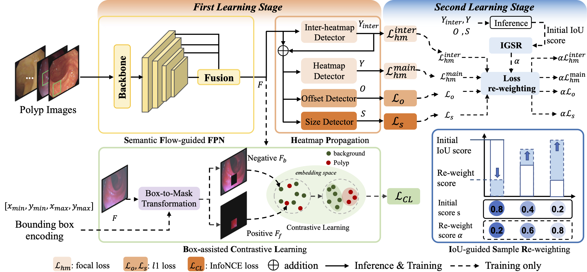
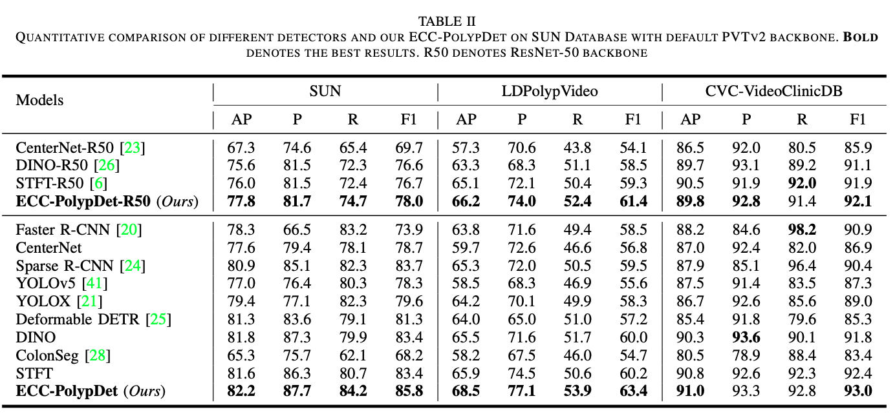
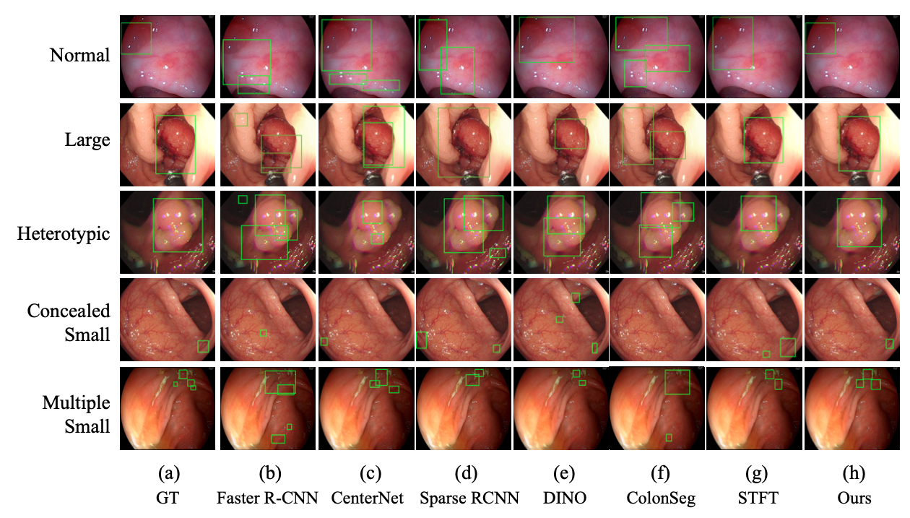

## [ECC-PolypDet: Enhanced CenterNet with Contrastive Learning for Automatic Polyp Detection]
by Yuncheng Jiang, Zixun Zhang, Yiwen Hu, Guanbin Li, Xiang Wan, Song Wu, Shuguang Cui, Silin Huang, Zhen Li

## Introduction
Accurate polyp detection is critical for early col- orectal cancer diagnosis. Although remarkable progress has been achieved in recent years, the complex colon environment and con- cealed polyps with unclear boundaries still pose severe challenges in this area. Existing methods either involve computationally expensive context aggregation or lack prior modeling of polyps, resulting in poor performance in challenging cases. In this paper, we propose the Enhanced CenterNet with Contrastive Learning (ECC-PolypDet), a two-stage training & end-to-end inference framework that leverages images and bounding box annotations to train a general model and fine-tune it based on the inference score to obtain a final robust model. Specifically, we conduct Box-assisted Contrastive Learning (BCL) during training to minimize the intra-class difference and maximize the inter-class difference between foreground polyps and backgrounds, enabling our model to capture concealed polyps. Moreover, to enhance the recognition of small polyps, we design the Semantic Flow- guided Feature Pyramid Network (SFFPN) to aggregate multi- scale features and the Heatmap Propagation (HP) module to boost the model’s attention on polyp targets. In the fine-tuning stage, we introduce the IoU-guided Sample Re-weighting (ISR) mechanism to prioritize hard samples by adaptively adjusting the loss weight for each sample during fine-tuning. Extensive experiments on six large-scale colonoscopy datasets demonstrate the superiority of our model compared with previous state-of

## Clone repository

```shell
git clone https://github.com/yuncheng97/ECC-PolypDet.git
cd ECC-PolypDet/
```

## File tree
```
ECC-PolypDet                           
├── README.md
├── pretrained
│   ├── best.pth
│   ├── pvt_v2_b2.pth
│   ├── resnet101-cd907fc2.pth
│   ├── resnet50-11ad3fa6.pth
│   └── resnet50-19c8e357.pth
├── retrain
├── adaptive_hard_mining.py
├── data.py
├── model.py
├── pvtv2.py
├── resnet.py
├── retrain.py
├── test.py
├── train.py
├── train.sh
└── utils.py
```

## Download dataset

The training and testing datasets come from public colonoscopy benchmarks: 'SUNSEG', 'LDPolypVideo', 'CVC-VideoClinicDB' and 'PolypGen'. Download these datasets and unzip them into `data` folder.

(Our own private dataset is undergoing ethical review and authorization processes within the relevant hospital)
- [SUNSEG](http://sundatabase.org/)
- [LDPolypVideo](https://github.com/dashishi/LDPolypVideo-Benchmark)
- [CVC-VideoClinicDB](https://giana.grand-challenge.org/) (*you need contact the author to get the access permission*)
- [PolypGen](https://doi.org/10.7303/syn26376615)

## Prerequisites

- [Python 3](https://www.python.org/)
- [Pytorch 1.11](http://pytorch.org/)
- [OpenCV 4.7](https://opencv.org/)
- [Numpy 1.23](https://numpy.org/)
- [Albumentations 1.3.1](https://github.com/albumentations-team/albumentations)


## Training
Set your own configuration before training. Make sure you set the right dataset path in '--data_path' and save path in '--save_path'.
```shell
    python train.py

    or

    bash train.sh
```

## Hard sample mining
```shell
    python adaptive_hard_mining.py
```
After hard sample mining, the weight of each training image will be saved in ./retrain folder.

## Retraining
```shell
    python retrain.py
```

## Testing

```shell
    python test.py
```

- Quantitative comparisons 


- Qualitative comparisons 


## Pretrained

download the pretrained backbone models and put them in the pretrained folder
- PVT[Baidu:bhrf](https://pan.baidu.com/s/1YT-lBXbFXNVKui-8EN1Mvg?pwd=bhrf)
- ResNet50[Baidu:hc2h](https://pan.baidu.com/s/1BstgyMaBG6yO_8QB3I6pAw?pwd=hc2h)
- ResNet101[Baidu:34an](https://pan.baidu.com/s/1GjnHTHaGgv_fIj6iDUW0qw?pwd=34an)
## Citation
- If you find this work is helpful, please cite our paper
```
@article{jiang2023ecc,
  title={ECC-PolypDet: Enhanced CenterNet With Contrastive Learning for Automatic Polyp Detection},
  author={Jiang, Yuncheng and Zhang, Zixun and Hu, Yiwen and Li, Guanbin and Wan, Xiang and Wu, Song and Cui, Shuguang and Huang, Silin and Li, Zhen},
  journal={IEEE Journal of Biomedical and Health Informatics},
  year={2023},
  publisher={IEEE}
}
```
